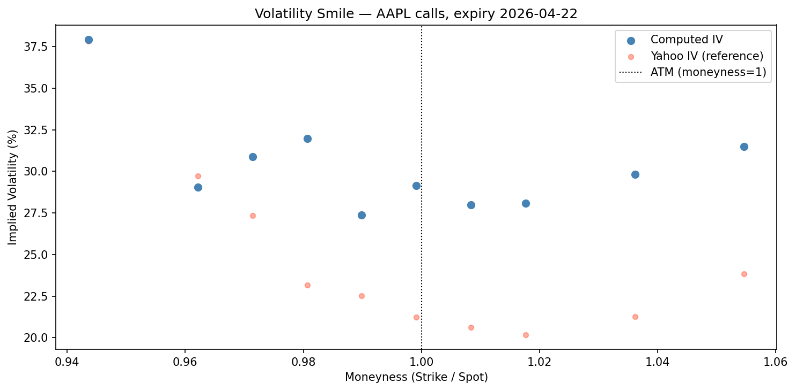

# Options Pricing

Implementations of classical option pricing models in Python, applied to real market data.

------------------------------------------------------------------------

## Models

-   Black-Scholes — closed-form pricing for European calls and puts
-   Monte Carlo — GBM path simulation, converges to BS price as N → ∞
-   Greeks — Delta, Gamma, Theta, Vega, Rho via analytical derivatives
-   Implied Volatility — Newton-Raphson inversion of BS; volatility smile and surface from live data

------------------------------------------------------------------------

## Repo structure

```         
├── src/
│   ├── black_scholes.py
│   ├── greeks.py
│   ├── monte_carlo.py
│   └── implied_vol.py
└── notebooks/
    ├── 01_black_scholes.ipynb
    ├── 02_monte_carlo.ipynb
    ├── 03_greeks.ipynb
    └── 04_implied_volatility.ipynb
```

`src/` contains pure functions with no side effects. Notebooks use these functions and show results, plots, and real market data via `yfinance`.

------------------------------------------------------------------------

## Notebooks

01 — Black-Scholes: price as a function of S, σ, and T. AAPL model price vs. market price.

02 — Monte Carlo: simulated GBM paths, terminal price distribution, convergence to BS price.

03 — Greeks: all five Greeks vs. S, Delta heatmap over S × T, Theta decay curve.

04 — Implied Volatility: Newton-Raphson solver verification, volatility smile, 3D volatility surface across expiries.

------------------------------------------------------------------------

## Key result

Black-Scholes assumes constant volatility. Real market prices imply different σ for every strike — the volatility smile. This is one of the model's most well-known failure modes and visible directly from live option chains.



------------------------------------------------------------------------

## Setup

``` bash
pip install -r requirements.txt
```

```         
numpy
scipy
matplotlib
yfinance
pandas
jupyter
```

------------------------------------------------------------------------

## Background

The BS price solves this PDE (no-arbitrage condition under continuous delta-hedging):

$$\frac{\partial V}{\partial t} + \frac{1}{2}\sigma^2 S^2 \frac{\partial^2 V}{\partial S^2} + rS\frac{\partial V}{\partial S} - rV = 0$$

Closed-form solution for a European call:

$$C = S \cdot N(d_1) - K e^{-rT} \cdot N(d_2)$$

$$d_1 = \frac{\ln(S/K) + (r + \sigma^2/2)\,T}{\sigma\sqrt{T}}, \quad d_2 = d_1 - \sigma\sqrt{T}$$